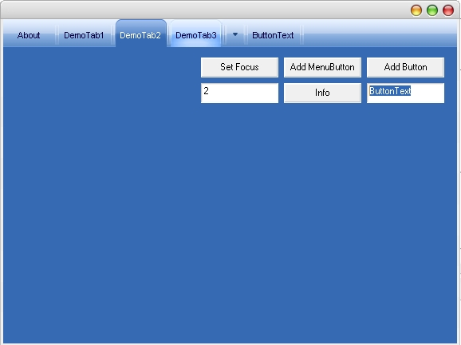



## Windows Media Player 10 TabMenu

### Description

This is an Usercontrol with the Windows Media Player 10 Tabs
 
### More Info
 

             |
---                |---
**Submitted On**   |2004-10-12 02:18:02
**By**             |[Gh€ttoWarr\!or](https://github.com/Planet-Source-Code/PSCIndex/blob/master/ByAuthor/gh-ttowarr-or.md)
**Level**          |Intermediate
**User Rating**    |5.0 (30 globes from 6 users)
**Compatibility**  |VB 5\.0, VB 6\.0
**Category**       |[Custom Controls/ Forms/  Menus](https://github.com/Planet-Source-Code/PSCIndex/blob/master/ByCategory/custom-controls-forms-menus__1-4.md)
**World**          |[Visual Basic](https://github.com/Planet-Source-Code/PSCIndex/blob/master/ByWorld/visual-basic.md)
**Archive File**   |[Windows\_Me18041510122004\.zip](https://github.com/Planet-Source-Code/gh-ttowarr-or-windows-media-player-10-tabmenu__1-56689/archive/master.zip)

